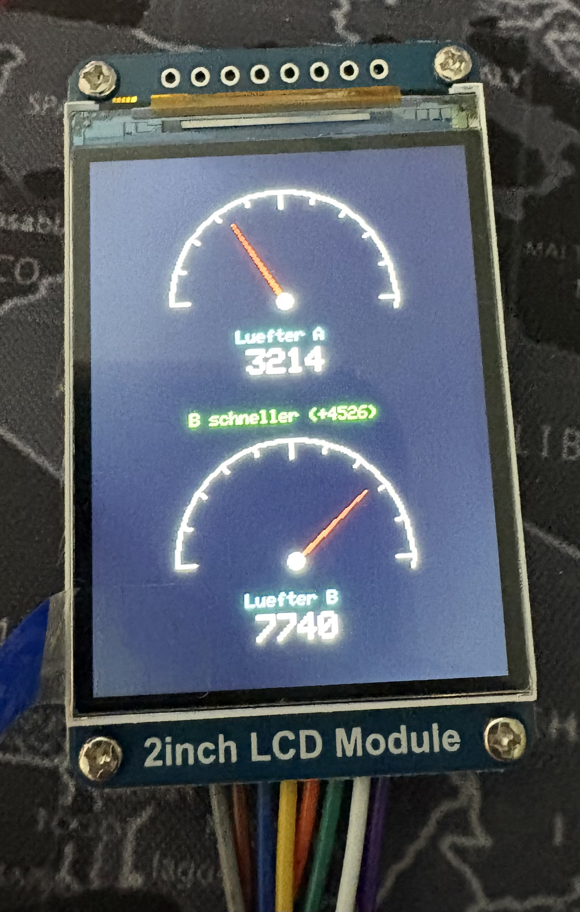

# Hardware-Datenbank

Alle Bauteile aus dem Elegoo Mega 2560 Starter Kit und zusaetzlich gekaufte Teile.
Jedes Bauteil ist mit Foto, Beschreibung und technischen Daten dokumentiert,
damit du es schnell in der Box wiederfindest.

## Bilder hinzufuegen

Fotos der Bauteile kommen in den Ordner `docs/hardware/bilder/`.
Dateiname: `bauteil-name.jpg` (z.B. `lcd-1602.jpg`, `trimmer-poti-10k.jpg`)

---

## Inhaltsverzeichnis

- [Hauptplatine](#hauptplatine)
- [Anzeige & Ausgabe](#anzeige--ausgabe)
- [Sensoren](#sensoren)
- [Aktoren & Motoren](#aktoren--motoren)
- [Passive Bauteile](#passive-bauteile)
- [Stromversorgung & Verbindung](#stromversorgung--verbindung)
- [Zusaetzlich gekaufte Teile](#zusaetzlich-gekaufte-teile)

---

## Hauptplatine

### Arduino Mega 2560 R3 (Elegoo)

| | |
|---|---|
| **Foto** |  |
| **Beschreibung** | Das Herzstück - ein Mikrocontroller-Board mit dem ATmega2560 Chip |
| **Spannung** | 5V (ueber USB oder externen Stecker) |
| **Digitale Pins** | 54 (davon 15 mit PWM) |
| **Analoge Pins** | 16 |
| **Speicher** | 256 KB Flash, 8 KB SRAM |
| **Takt** | 16 MHz |
| **Anschluss** | USB Typ B (das quadratische) |
| **Erkennungsmerkmal** | Grosse blaue Platine, "ELEGOO MEGA 2560 R3" aufgedruckt |
| **Eingesetzt in** | Drehzahlmesser, alle Projekte |

---

## Anzeige & Ausgabe

### LCD 1602A Display (QAPASS)

| | |
|---|---|
| **Foto** |  |
| **Beschreibung** | Textdisplay mit 16 Zeichen pro Zeile, 2 Zeilen. Zeigt Text und Zahlen an. |
| **Pins** | 16 Pins (ohne I2C-Adapter) |
| **Spannung** | 5V |
| **Ansteuerung** | 4-Bit oder 8-Bit Modus, braucht Potentiometer fuer Kontrast |
| **Bibliothek** | LiquidCrystal (in Arduino IDE enthalten) |
| **Erkennungsmerkmal** | Gruenes/blaues Rechteck, ca. 8cm breit, 16 Pins oben, "QAPASS" auf der Rueckseite |
| **Eingesetzt in** | Drehzahlmesser |

### RGB LED

| | |
|---|---|
| **Foto** |  |
| **Beschreibung** | Eine LED die jede Farbe mischen kann (Rot + Gruen + Blau) |
| **Pins** | 4 (Laengstes Beinchen = gemeinsame Kathode oder Anode) |
| **Spannung** | 2-3V pro Farbe (mit Vorwiderstand an 5V) |
| **Erkennungsmerkmal** | Sieht aus wie eine normale LED, aber mit 4 Beinchen statt 2 |
| **Eingesetzt in** | - |

### LEDs (einzeln, verschiedene Farben)

| | |
|---|---|
| **Foto** |  |
| **Beschreibung** | Standard-Leuchtdioden in verschiedenen Farben |
| **Farben** | Rot, Gelb, Gruen, Blau, Weiss (je 5 Stueck) |
| **Pins** | 2 (laengeres Beinchen = Plus/Anode, kuerzeres = Minus/Kathode) |
| **WICHTIG** | IMMER mit Vorwiderstand (220 Ohm) verwenden! Ohne Widerstand brennt die LED sofort durch! |
| **Erkennungsmerkmal** | Kleine durchsichtige oder farbige Koepfe, 2 Beinchen unterschiedlich lang |
| **Eingesetzt in** | - |

### 7-Segment-Anzeige (1-stellig)

| | |
|---|---|
| **Foto** |  |
| **Beschreibung** | Zeigt eine einzelne Ziffer (0-9) an, wie bei einem Wecker |
| **Pins** | 10 |
| **Erkennungsmerkmal** | Kleines rotes Rechteck mit einer Ziffer, ca. 1.5cm hoch |
| **Eingesetzt in** | - |

### 7-Segment-Anzeige (4-stellig)

| | |
|---|---|
| **Foto** |  |
| **Beschreibung** | Zeigt vier Ziffern gleichzeitig an (z.B. Uhrzeit, Zaehler) |
| **Pins** | 12 |
| **Erkennungsmerkmal** | Laengeres rotes Rechteck mit vier Ziffern, ca. 4cm breit |
| **Eingesetzt in** | - |

### 8x8 LED Matrix

| | |
|---|---|
| **Foto** |  |
| **Beschreibung** | 64 LEDs in einem Raster - kann Muster, Buchstaben und einfache Grafiken anzeigen |
| **Pins** | 16 |
| **Erkennungsmerkmal** | Quadratisches rotes Feld mit vielen kleinen Punkten, ca. 3x3cm |
| **Eingesetzt in** | - |

### Aktiver Buzzer

| | |
|---|---|
| **Foto** |  |
| **Beschreibung** | Macht einen Piep-Ton wenn Strom fliesst. Einfach Ein/Aus. |
| **Pins** | 2 (Plus markiert mit +) |
| **Erkennungsmerkmal** | Schwarzer Zylinder, Oberseite GESCHLOSSEN, "+" Zeichen auf einer Seite |
| **Unterschied zu passiv** | Hat einen Aufkleber auf der Oberseite, aktiver Buzzer piept von selbst |
| **Eingesetzt in** | - |

### Passiver Buzzer

| | |
|---|---|
| **Foto** |  |
| **Beschreibung** | Kann verschiedene Toene/Melodien spielen, braucht PWM-Signal |
| **Pins** | 2 (Plus markiert mit +) |
| **Erkennungsmerkmal** | Schwarzer Zylinder, Oberseite OFFEN (gruene Platine sichtbar), kein Aufkleber |
| **Unterschied zu aktiv** | Kein Aufkleber, offene Oberseite. Piept NICHT von selbst - braucht Signal |
| **Eingesetzt in** | - |

---

## Sensoren

### DHT11 Temperatur- & Feuchtigkeitssensor

| | |
|---|---|
| **Foto** |  |
| **Beschreibung** | Misst Temperatur (-20 bis 60°C) und Luftfeuchtigkeit (20-90%) |
| **Pins** | 3 oder 4 (VCC, DATA, GND, evtl. 1 Pin nicht angeschlossen) |
| **Spannung** | 3.3V - 5V |
| **Bibliothek** | DHT sensor library (Adafruit) |
| **Erkennungsmerkmal** | Blaues oder weisses Kaestchen mit Gitteroeffnung, ca. 1.5x1.5cm |
| **Eingesetzt in** | - |

### Ultraschallsensor HC-SR04

| | |
|---|---|
| **Foto** |  |
| **Beschreibung** | Misst Entfernung mit Schallwellen (2cm bis 400cm) |
| **Pins** | 4 (VCC, Trig, Echo, GND) |
| **Spannung** | 5V |
| **Erkennungsmerkmal** | Zwei silberne "Augen" (Sender + Empfaenger), blaue Platine |
| **Eingesetzt in** | - |

### PIR Bewegungsmelder HC-SR501

| | |
|---|---|
| **Foto** |  |
| **Beschreibung** | Erkennt Bewegungen von Menschen/Tieren durch Infrarot-Waermestrahlung |
| **Pins** | 3 (VCC, OUT, GND) |
| **Spannung** | 5V - 20V |
| **Erkennungsmerkmal** | Runde weisse Kunststoffkuppel auf gruener Platine, ca. 3cm Durchmesser |
| **Eingesetzt in** | - |

### Fotowiderstand (LDR)

| | |
|---|---|
| **Foto** |  |
| **Beschreibung** | Lichtsensor - Widerstand aendert sich je nach Helligkeit |
| **Pins** | 2 (keine Polaritaet - egal rum) |
| **Erkennungsmerkmal** | Kleines rundes Teil mit Schlangenlinien-Muster auf der Oberflaeche |
| **Eingesetzt in** | - |

### Neigungssensor (Tilt Switch)

| | |
|---|---|
| **Foto** |  |
| **Beschreibung** | Erkennt Kippen/Neigen - im Inneren rollt eine kleine Kugel |
| **Pins** | 2 |
| **Erkennungsmerkmal** | Kleines metallisches Roehrchen, ca. 1cm lang |
| **Eingesetzt in** | - |

### Joystick-Modul

| | |
|---|---|
| **Foto** |  |
| **Beschreibung** | 2-Achsen Analogstick (wie ein Gamepad) mit eingebautem Taster |
| **Pins** | 5 (GND, +5V, VRx, VRy, SW) |
| **Erkennungsmerkmal** | Kleiner Hebel auf einer Platine, laesst sich in alle Richtungen bewegen |
| **Eingesetzt in** | - |

### IR-Empfaenger (fuer Fernbedienung)

| | |
|---|---|
| **Foto** |  |
| **Beschreibung** | Empfaengt Signale von der mitgelieferten IR-Fernbedienung |
| **Pins** | 3 (Signal, GND, VCC) |
| **Bibliothek** | IRremote |
| **Erkennungsmerkmal** | Kleines schwarzes Teil mit halbrundem Kopf, 3 Beinchen |
| **Eingesetzt in** | - |

### IR-Fernbedienung

| | |
|---|---|
| **Foto** |  |
| **Beschreibung** | Sendet Infrarot-Befehle an den IR-Empfaenger |
| **Erkennungsmerkmal** | Kleine weisse Fernbedienung mit Zahlentasten |
| **Eingesetzt in** | - |

### RFID-Modul RC522

| | |
|---|---|
| **Foto** |  |
| **Beschreibung** | Liest kontaktlose RFID-Karten und Schluesselanhaenger |
| **Pins** | 8 (SDA, SCK, MOSI, MISO, IRQ, GND, RST, 3.3V) |
| **Spannung** | 3.3V (NICHT 5V!) |
| **Bibliothek** | MFRC522 |
| **Erkennungsmerkmal** | Blaue Platine mit grosser Kupferspule, ca. 4x6cm |
| **Eingesetzt in** | - |

### Tastenfeld (4x4 Matrix Keypad)

| | |
|---|---|
| **Foto** |  |
| **Beschreibung** | 16 Tasten (0-9, A-D, *, #) fuer Eingaben wie PIN-Codes |
| **Pins** | 8 (4 Reihen + 4 Spalten) |
| **Bibliothek** | Keypad |
| **Erkennungsmerkmal** | Flache Folientastatur mit Flachbandkabel, ca. 7x7cm |
| **Eingesetzt in** | - |

---

## Aktoren & Motoren

### Servo Motor SG90

| | |
|---|---|
| **Foto** |  |
| **Beschreibung** | Dreht sich auf eine bestimmte Position (0-180 Grad) |
| **Kabel** | 3 (Orange=Signal, Rot=VCC, Braun=GND) |
| **Spannung** | 4.8V - 6V |
| **Bibliothek** | Servo (in Arduino IDE enthalten) |
| **Erkennungsmerkmal** | Kleiner blauer Motor mit weissem Drehhebel oben, ca. 2x3cm |
| **Eingesetzt in** | - |

### Schrittmotor 28BYJ-48 + Treiberplatine ULN2003

| | |
|---|---|
| **Foto** |  |
| **Beschreibung** | Dreht sich in exakten kleinen Schritten - ideal fuer praezise Positionierung |
| **Kabel** | 5-poliger Stecker zur Treiberplatine |
| **Treiberplatine** | ULN2003 - verbindet Motor mit Arduino (4 Eingangspins + Strom) |
| **Erkennungsmerkmal** | Runder silberner Motor mit blauem Deckel + gruene Platine mit LEDs |
| **Eingesetzt in** | - |

### DC Motor + Propeller

| | |
|---|---|
| **Foto** |  |
| **Beschreibung** | Einfacher Gleichstrommotor - dreht sich wenn Strom fliesst |
| **Kabel** | 2 (keine Polaritaet fuer Funktion, aber Drehrichtung aendert sich) |
| **WICHTIG** | Nicht direkt an Arduino-Pin anschliessen! Braucht Transistor oder Relais. |
| **Erkennungsmerkmal** | Kleiner silberner Zylinder mit Achse, dazu ein Propeller |
| **Eingesetzt in** | - |

### Relais-Modul (5V)

| | |
|---|---|
| **Foto** |  |
| **Beschreibung** | Elektronischer Schalter - kann groessere Geraete ein/ausschalten |
| **Pins** | 3 Steuerseite (VCC, GND, IN) + 3 Schaltseite (COM, NO, NC) |
| **Erkennungsmerkmal** | Blaues Kaestchen auf gruener Platine mit Schraubklemmen |
| **ACHTUNG** | Kann Netzspannung (230V) schalten - NUR unter Aufsicht und mit Wissen! |
| **Eingesetzt in** | - |

---

## Passive Bauteile

### Trimmer-Potentiometer 10K (Yu Jian)

| | |
|---|---|
| **Foto** |  |
| **Beschreibung** | Regelbarer Widerstand (0 bis 10.000 Ohm). Hier fuer LCD-Kontrast verwendet. |
| **Pins** | 3 (Links=5V, Mitte=Ausgang, Rechts=GND) |
| **Einstellung** | Mit Schraubendreher in der Sechskant-Oeffnung drehen |
| **Erkennungsmerkmal** | Kleines schwarzes rundes Teil, "10K" aufgedruckt, 3 Beinchen, Sechskant-Loch oben |
| **NICHT VERWECHSELN MIT** | Rotary Encoder (hat 5 Pins: CLK, DT, SW, GND, +) |
| **Eingesetzt in** | Drehzahlmesser (LCD-Kontrast) |

### Rotary Encoder (Drehgeber)

| | |
|---|---|
| **Foto** |  |
| **Beschreibung** | Drehschalter mit Rasterung und eingebautem Taster - KEIN Potentiometer! |
| **Pins** | 5 (CLK, DT, SW, GND, +) |
| **Erkennungsmerkmal** | Hat eine Drehachse mit Rasterung (klickt beim Drehen), 5 Pins auf der Platine |
| **NICHT VERWECHSELN MIT** | Trimmer-Poti (hat nur 3 Beinchen, kein Klicken) |
| **Eingesetzt in** | - |

### Widerstaende

| | |
|---|---|
| **Foto** |  |
| **Beschreibung** | Begrenzen den Stromfluss - wie ein enger Wasserschlauch |
| **Werte im Kit** | 10, 100, 220, 330, 1K, 2K, 5.1K, 10K, 100K, 1M Ohm |
| **Erkennungsmerkmal** | Kleine Zylinder mit farbigen Ringen (die Ringe zeigen den Wert an) |
| **Wichtigste Farbcodes** | 220 Ohm = Rot-Rot-Braun (fuer LEDs), 10K = Braun-Schwarz-Orange |
| **Eingesetzt in** | Drehzahlmesser (220 Ohm fuer LCD-Hintergrundbeleuchtung) |

### 74HC595 Schieberegister

| | |
|---|---|
| **Foto** |  |
| **Beschreibung** | Erweitert die Anzahl digitaler Ausgaenge - aus 3 Pins werden 8 |
| **Pins** | 16 (IC-Chip) |
| **Erkennungsmerkmal** | Schwarzer laenglicher Chip mit 16 Beinchen, Kerbe an einer Seite |
| **Eingesetzt in** | - |

### Taster (Push Button)

| | |
|---|---|
| **Foto** |  |
| **Beschreibung** | Schalter der nur funktioniert solange man drueckt |
| **Pins** | 4 (aber jeweils 2 sind intern verbunden) |
| **Erkennungsmerkmal** | Kleine quadratische Plastikteile mit Knopf oben, 4 Metallbeinchen |
| **Eingesetzt in** | - |

---

## Stromversorgung & Verbindung

### Breadboard (830 Kontakte)

| | |
|---|---|
| **Foto** |  |
| **Beschreibung** | Steckplatine zum Aufbau von Schaltungen ohne Loeten |
| **Aufbau** | 2 Stromleisten oben/unten (+ und -), Steckbereich in der Mitte |
| **Erkennungsmerkmal** | Weisse/beige Plastikplatte mit vielen Loechern in Reihen |
| **Eingesetzt in** | Drehzahlmesser, alle Projekte |

### Breadboard Stromversorgungsmodul

| | |
|---|---|
| **Foto** |  |
| **Beschreibung** | Versorgt das Breadboard mit 3.3V oder 5V aus externer Quelle |
| **Eingaenge** | DC-Buchse (6.5-12V) oder USB |
| **Ausgaenge** | 2x Stromleisten (je umschaltbar 3.3V/5V via Jumper) |
| **WICHTIG** | Jumper auf 5V stellen fuer unsere Projekte! |
| **Erkennungsmerkmal** | Kleine schwarze Platine die auf die Stromleisten des Breadboards gesteckt wird |
| **Eingesetzt in** | Drehzahlmesser |

### 9V Netzteil

| | |
|---|---|
| **Foto** |  |
| **Beschreibung** | Externe Stromversorgung fuer das Breadboard-Stromversorgungsmodul |
| **Erkennungsmerkmal** | Schwarzes Steckernetzteil mit rundem DC-Stecker |
| **Eingesetzt in** | Drehzahlmesser |

### USB-Kabel (Typ A auf Typ B)

| | |
|---|---|
| **Foto** |  |
| **Beschreibung** | Verbindet Arduino mit PC fuer Code-Upload und Seriellen Monitor |
| **Erkennungsmerkmal** | Blaues Kabel, grosser flacher Stecker (PC) + quadratischer Stecker (Arduino) |
| **Eingesetzt in** | Alle Projekte |

### Jumperkabel

| | |
|---|---|
| **Foto** |  |
| **Beschreibung** | Verbindungskabel in drei Varianten |
| **Typen** | Male-Male (Stift-Stift), Male-Female (Stift-Buchse), Female-Female (Buchse-Buchse) |
| **Erkennungsmerkmal** | Bunte Kabelbunedel mit verschiedenen Steckerenden |
| **Eingesetzt in** | Alle Projekte |

---

## Zusaetzlich gekaufte Teile

### Gabellichtschranke LM393

| | |
|---|---|
| **Foto** |  |
| **Beschreibung** | U-foermige Lichtschranke - erkennt wenn etwas den IR-Strahl unterbricht |
| **Pins** | 3-4 (VCC, GND, D0/OUT, evtl. A0) |
| **Spannung** | 3.3V - 5V |
| **Erkennungsmerkmal** | Platine mit U-foermiger Gabel am Rand |
| **Gekauft** | Amazon (Heevhas, 3 Stueck) |
| **Eingesetzt in** | Drehzahlmesser |

### IR-Reflexionssensor (FC-51 Typ)

| | |
|---|---|
| **Foto** |  |
| **Beschreibung** | Erkennt Hindernisse oder reflektierende Flaechen per Infrarot |
| **Pins** | 3 (VCC, GND, OUT) |
| **Spannung** | 3.3V - 5V |
| **Einstellbar** | Ja, Poti auf der Platine fuer Empfindlichkeit |
| **Erkennungsmerkmal** | Kleine Platine mit 2 schwarzen "Augen" (IR-Sender + Empfaenger) |
| **Gekauft** | Amazon (5 Stueck) |
| **Eingesetzt in** | - |

### ESP8266 WiFi-Modul

| | |
|---|---|
| **Foto** |  |
| **Beschreibung** | WLAN-Modul - verbindet den Arduino mit dem Internet/Heimnetzwerk |
| **Spannung** | 3.3V (NICHT 5V! Braucht evtl. Spannungsteiler) |
| **Erkennungsmerkmal** | Kleine blaue Platine mit Antenne und silbernem Metallgehaeuse |
| **Gekauft** | Amazon |
| **Eingesetzt in** | - |

### HC-05 / HC-06 Bluetooth-Modul

| | |
|---|---|
| **Foto** |  |
| **Beschreibung** | Bluetooth-Verbindung - Arduino per Handy-App steuern |
| **Spannung** | 3.3V - 6V |
| **Erkennungsmerkmal** | Platine mit silbernem Metallgehaeuse, oft Aufschrift "HC-05" oder "HC-06" |
| **Gekauft** | Amazon |
| **Eingesetzt in** | - |

### WS2812B LED-Streifen (Neopixel)

| | |
|---|---|
| **Foto** |  |
| **Beschreibung** | Adressierbare RGB-LEDs - jede LED einzeln in jeder Farbe steuerbar |
| **Kabel** | 3 (5V, GND, DIN/Data) |
| **Spannung** | 5V |
| **Bibliothek** | Adafruit NeoPixel oder FastLED |
| **Erkennungsmerkmal** | Flexibler Streifen mit vielen kleinen quadratischen LEDs |
| **Gekauft** | Amazon |
| **Eingesetzt in** | - |

### OLED-Display 0.96" SSD1306

| | |
|---|---|
| **Foto** |  |
| **Beschreibung** | Kleines hochaufloestendes Display fuer Grafiken und Text (128x64 Pixel) |
| **Pins** | 4 (VCC, GND, SCL, SDA) - I2C |
| **Spannung** | 3.3V - 5V |
| **Bibliothek** | Adafruit SSD1306 + Adafruit GFX |
| **Erkennungsmerkmal** | Winziges Display, ca. 2.5x1.5cm, 4 Pins (GND, VCC, SCL, SDA), sehr duenn |
| **Anschluss am Mega** | GND→GND, VCC→5V, SCL→Pin 21, SDA→Pin 20 |
| **I2C-Adresse** | 0x3C (manche 0x3D) |
| **Gekauft** | Amazon (vorhanden) |
| **Eingesetzt in** | Drehzahlmesser (OLED-Version) |

### Waveshare 2" LCD Modul (ST7789, IPS Farbe)

| | |
|---|---|
| **Foto** |  |
| **Beschreibung** | Farbdisplay mit IPS-Panel, 240x320 Pixel. Zeigt Grafiken, Text, Farben. |
| **Treiber** | ST7789V |
| **Anschluss** | SPI (4-Draht) |
| **Pins** | 8 (VCC, GND, DIN, CLK, CS, DC, RST, BL) |
| **Spannung** | 3.3V/5V (bei Arduino: 5V verwenden!) |
| **Bibliothek** | Adafruit ST7735/ST7789 + Adafruit GFX |
| **Anschluss am Mega** | VCC→5V, GND→GND, DIN→51, CLK→52, CS→10, DC→9, RST→8, BL→5V |
| **Erkennungsmerkmal** | Farbdisplay ca. 5.8x3.5cm, IPS, 8-Pin-Stecker |
| **Gekauft** | Amazon (Waveshare, vorhanden) |
| **Eingesetzt in** | Drehzahlmesser (Farbversion) |

---

## So fuegst du Fotos hinzu

1. Fotografiere das Bauteil gut beleuchtet auf weissem Hintergrund
2. Schicke mir das Foto hier im Chat
3. Speichere es in `docs/hardware/bilder/` mit dem passenden Namen
4. Das Bild erscheint dann automatisch in dieser Datenbank

**Dateinamen-Konvention:** `bauteil-name.jpg` (Kleinbuchstaben, Bindestriche)
